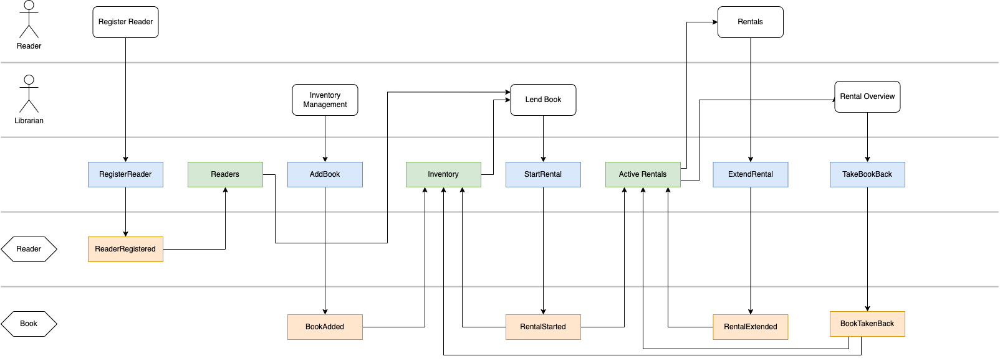

# Axon Library

This repository is mainly used as demo and training repository for conferences and workshops. The goal is to explain the basics of the [Axon Framework](https://developer.axoniq.io/axon-framework/overview) by means of renting a book in a library. The following picture includes all commands, events and read models which are used in the course of this implementation. The style of this diagram is called blueprint. A blueprint is created during an [Event Modeling](https://eventmodeling.org/posts/what-is-event-modeling/) session.



If you want the complete demo code, please refer to the main branch.  
To use the code as starting point for coding along in workshops, please use the init branch:
`git switch init`.
If you want to code along, consider creating a branch for yourself:
`git switch -c <my own code along branch>`.
You can use this branch for preserving your work by committing your own solution:
```
git add .
git commit -am "<your commit message>"
```

The repository provides several tags. 
Please use these tags to get a working state after each exercise / section of the workshop:
`git checkout <tag>`.
Then you can check out a new branch for coding along (`git switch -c <new code along branch>`).
